<div align="center">



[](LICENSE)
[](https://github.com/Nekuzaky/Chroma/releases)
[](https://unity.com/)
[](https://github.com/Nekuzaky/Chroma/actions)
[](https://github.com/Nekuzaky/Chroma/stargazers)

</div>

Editor-only Unity extension that color-codes your **Hierarchy** and **Project-window folders**, and **enforces your team's scene conventions** — with **zero runtime cost**.

Chroma's config lives in a git-friendly asset committed with your repo: every teammate sees the same colors, the same rules, the same self-documenting scenes.

<!-- TODO: add a demo GIF of Chroma in action here once available, e.g.:
<p align="center"></p>
-->

## Table of Contents

- [Features](#features)
- [How to Use](#how-to-use)
- [Installation](#installation)
- [Requirements](#requirements)
- [Contributing](#contributing)
- [Found a Bug?](#found-a-bug)
- [Changelog](#changelog)
- [License](#license)

## Features

### Colored Banners
Create colored headers in the Hierarchy using two methods:

**By name** — Rename a GameObject with a spec like:
```
#1f6feb center bold=Title
```

<details>
<summary>Full banner spec syntax</summary>

- Color: hex codes or color names (red, blue, green, etc.)
- Gradient: `#color1>color2` (e.g., `#ff0000>0000ff`)
- Alignment: `left` / `center` / `right`
- Style: `bold` / `italic` / `bolditalic` / `normal`
- Size: `s12` (font size in pixels)
- Text color: `text:#ffffff` or `t:#fff`
- Text-only: `nobg` (no background, just colored text)

</details>

**By component** — Add a `ChromaBanner` component to keep the real GameObject name clean, with separate fields for color, gradient, text, alignment, and style.

### Convention Linter ⭐
Chroma doesn't just *decorate* your scenes — it **enforces your team's conventions**. Define rules in the shared config (scope + assertion + severity + message) and offending rows get an inline severity icon with the rule's message as tooltip.

| Assertion | Fails when… |
|---|---|
| `HasBanner` | the object has neither a name banner nor a `ChromaBanner` component |
| `NameRegex` | the name doesn't match a pattern (ReDoS-safe) |
| `NoEmpty` | the object has no components (besides Transform) and no children |
| `NoMissingScript` | a deleted script is still referenced |
| `RequiredParent` | the expected ancestor (by name or component, e.g. `Canvas`) is missing |
| `MaxDepth` | nesting goes deeper than N levels |
| `NoDefaultName` | the name is a Unity default (`GameObject`, `Cube`, `Cube (3)`…) |

Scopes: every object, roots only, by Tag, Layer, name prefix, or regex.

- **Lint tab** in the Chroma window: live violation counts, grouped list, jump / select-all / ignore, full rule editor, ready-made rulesets (starter & strict)
- **Team-first**: rules ship in the committed config — every dev sees the same warnings
- **Per-user ignores** (right-click ▸ Chroma ▸ Lint - Toggle Ignore) and a bindable *Next Lint Violation* shortcut
- **Fast**: debounced scans, O(1) per-row lookups, paused during play mode

### Row Widgets
- **Active toggle** — always-visible checkbox on every row; click toggles `SetActive` with full Undo
- **Component icons** — see each object's components at a glance (cached, capped, configurable)

### Separators
Create visual dividers by naming objects `---` or `___`:
- Solid, Dashed, Dotted, or Double line styles
- Optional centered caption: `--- My Section`

### Tree Guide Lines
File-explorer style connector lines in the Hierarchy indent gutter.

### Auto-Color Rules
Automatically tint rows by:
- **Tag** — Match by GameObject tag
- **Layer** — Match by Layer
- **Name prefix** — Match by name start (e.g., "Enemy_")
- **Regex** — Match by regex pattern (with ReDoS protection)

### Child Color Inheritance
Children inherit parent banner colors:
- **Flat** — constant opacity
- **DepthFade** — fades per nesting level

### Display Extras
- Child count: show `(N)` next to each GameObject
- Zebra striping: alternate row colors for readability
- Missing script warnings: warning icon (with tooltip) on GameObjects with deleted scripts
- Bookmarks: mark, jump to, and reorder GameObjects

### Project Window Colors
Color folders in the Project window, with optional inheritance to child folders.

### RGB Mode
Animate Hierarchy rows and Project-window folders through rainbow colors (~30fps), with Halloween / Christmas / Valentine themes.

### Themes & Presets
Quick color schemes — Minimal, Vibrant, Soft, High-Contrast, plus two **colorblind-safe palettes** (Okabe-Ito and IBM, deuteranopia/protanopia friendly) — and reusable banner presets.

### Custom Banner Font
Use a Font asset or any installed system font (Sans / Serif / Mono / Comic).

### Build Stripping
Banner specs and `ChromaBanner` components are automatically removed from built scenes.

## How to Use

### Open Chroma
Go to **Tools ▸ Chroma** to open the settings panel.

### Selection Tab
1. Select a GameObject in the Hierarchy
2. Choose a color and style
3. **Apply banner** — stores the spec in the GameObject name
4. **Add component** — adds a `ChromaBanner` component instead
5. **Apply title only** — renames a banner while keeping its colors

### Settings Tab
Configure:
- Display toggles (banners, separators, tree lines, row widgets, etc.)
- Tree line color
- Separator style and colors
- Child color inheritance (flat or depth-fade)
- Auto-color rules (Tag, Layer, prefix, regex)
- RGB mode speed, saturation, brightness
- Folder colors in the Project window
- Themes (incl. colorblind-safe) and presets
- Build stripping options

### Lint Tab
1. Load a ready-made ruleset (**starter** or **strict**) or write your own rules
2. Violations appear live: inline icons in the Hierarchy + grouped list in the tab
3. Click a violation to jump to it, **Select all** per rule, or **Ignore** locally
4. Bind **Chroma/Next Lint Violation** in Edit ▸ Shortcuts to cycle through issues

### Quick Actions
- Right-click a GameObject ▸ **Chroma** — bookmark, copy/paste style, strip, lint-ignore
- Right-click a folder ▸ **Chroma ▸ Folder Color** — color the folder in the Project window

## Installation

### Via Package Manager (recommended)
1. In Unity, go to **Window ▸ Package Manager**
2. Click **+ ▸ Add package from git URL…**
3. Paste: `https://github.com/Nekuzaky/Chroma.git?path=Assets/_/Code/Chroma`
4. Click **Add**

### Manual
Copy `Assets/_/Code/Chroma` into your project's `Assets` folder.

## Requirements

- Unity 2021.3 LTS or newer (works on Unity 6)
- Editor-only — no impact on runtime or builds

## Contributing

Contributions are welcome! Please read [CONTRIBUTING.md](.github/CONTRIBUTING.md) for guidelines on reporting issues, proposing features, and submitting pull requests.

## Found a Bug?

Open an [issue](https://github.com/Nekuzaky/Chroma/issues) or reach out:
- **Email**: contact@nekuzaky.com
- **Website**: https://www.nekuzaky.com/contact

## Changelog

See [CHANGELOG.md](CHANGELOG.md) for the full version history.

## License

MIT License — see [LICENSE](LICENSE) file for details.

You are free to use, modify, and distribute this software for any purpose.
